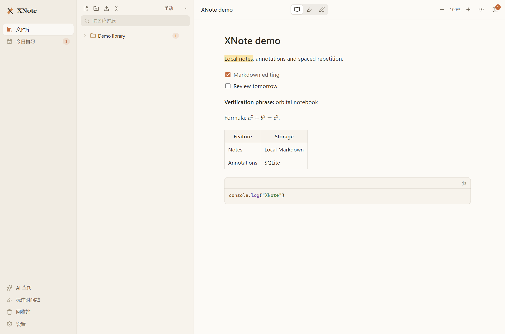

# XNote

[English](README.md) · [架构说明](docs/architecture.md) · [验证记录](docs/validation.md)

一个结合 Markdown、文档标注、间隔复习和可选 AI 助手的本地桌面笔记软件。

XNote 是个人学习项目，当前版本 **0.1.0**。适合把课程笔记和阅读文件放进同一文件库，记录标注，并通过 FSRS 调度重新复习整篇文档。

## 主要功能

- 文件夹式文件库：新建 Markdown、导入文件、重命名、移动和回收站恢复。
- CodeMirror 实时 Markdown 预览，支持源码模式、查找替换、表格、代码高亮、公式、Mermaid 和图片尺寸调整。粘贴图片集中存入专用附件文件夹。
- 内置 PDF、DOCX、图片、表格/CSV 和文本阅读器；没有专用阅读器的格式可以用系统程序打开。
- 在阅读器支持的范围内使用高亮、下划线、批注、区域标注和自由画笔。标注与原文件分开保存。
- 整篇文档的 FSRS 复习、四档评分、心得、文件夹继承参数组、考试日期和每日数量/时间预算。
- 可选 AI 文件库搜索和多会话问答，支持当前文档上下文、引用与工具步骤。已提供 OpenAI、DeepSeek、Anthropic、Google 适配，实际模型可用性需向服务商核对。Mock 模式不需要密钥。

## 实际演示



截图由离线运行测试使用合成笔记生成，不含个人文件库数据。运行 `npm test` 可重新生成，图片位于 `test-results/demo.png`。不同运行的 UUID、时间戳、渲染细节和生成文件不要求字节完全一致。

## 环境要求

本地已验证：**Windows 11 x64**、**Node.js 22.23.2**、**npm 10.9.8**、锁文件中的 **Electron 33.4.11**。`.nvmrc` 记录已测试的 Node 版本。其他操作系统和架构未验证；打包配置面向 Windows。

安装 Git 和带 npm 的 Node.js。安装过程需要访问 npm、Electron 和原生模块下载服务。如果没有可用的原生预编译模块，可能需要 Python 3 和包含 C++ 支持的 Visual Studio Build Tools。其余应用依赖均由锁文件声明，无须安装全局应用包。

## 快速开始

```powershell
git clone https://github.com/Sean-xzx/note-tracker-XNote.git
cd note-tracker-XNote
npm ci --no-audit --no-fund
npm run rebuild
npm run dev
```

`rebuild` 将 SQLite 原生模块适配到 Electron 的 ABI。重新安装依赖或修改 Electron 后，应再次执行。参见 [Electron 原生模块说明](https://www.electronjs.org/docs/latest/tutorial/using-native-node-modules)。

成功时会出现 XNote 桌面窗口，包含文件库、复习导航和设置。新配置的文件库为空。创建、编辑、标注和复习笔记不需要下载数据库或填写 API 密钥。

运行本地编译版本：

```powershell
npm run build
npm start
```

Windows 上也可使用 `启动XNote.bat`，它从自身目录启动；缺少编译入口时会先构建。此前仍需完成上述依赖安装和原生模块重建。

## 代表性示例

1. 创建文件夹和 Markdown 笔记，粘贴：

```markdown
# My first review

Local notes are searchable.

- [ ] Recall this idea tomorrow
```

2. 等待保存状态，切换笔记再打开，文字应保留。新 Markdown 笔记进入当天复习；普通导入文件默认不安排复习，需手动加入。
3. 切到标注模式，选择 “Local notes” 并高亮；标注应出现在侧栏，并在重启后保留。
4. 打开今日复习，先回想再阅读，选择四档评分之一，可填写心得。历史应记录评分，下次间隔至少为一天。
5. 免费 AI 演示：设置中选择 **Mock**，关闭联网搜索，提问 `总结《My first review》`。预期得到明确标注的模拟回答，而非真实模型解读。

对应自动测试使用独立临时数据，成功时输出 `ALL VERIFICATION CHECKS PASSED`。

## 配置与资源

没有必须填写的 `.env`。可选服务和模型在设置页配置。真实聊天、嵌入、视觉和联网搜索需要相应服务密钥及网络，可能产生服务商费用；离线测试不会调用它们。请选择服务商当前提供的模型，内置默认名称不代表兼容性承诺。

聊天和嵌入可使用不同服务。OpenAI/Google 适配器支持真实向量嵌入；没有可用嵌入服务时可使用关键词索引/搜索。Mock 用于功能演示。需要语义检索或图片描述时，在设置页为文件库建立索引。扫描 PDF 尚无完整 OCR 流程。

应用数据保存在 Electron `userData`，Windows 通常为 `%APPDATA%/xnote`：包含 `xnote.db`、`notes/`、`files/`、`ai-settings.json` 和 `ai-keys.enc`。部分界面偏好使用 localStorage。备份时应关闭软件并复制整个配置目录；仅备份数据库不包含正文和文件内容。导入操作会复制文件，界面的文件夹是数据库关系，不是磁盘目录镜像。

密钥优先使用 Electron `safeStorage`；不可用时的编码回退并非加密。设置页会显示加密可用性。不要提交配置目录、密钥文件或个人导出。源码运行通常与其他 XNote 运行共用配置；只有 `npm test` 保证使用新的独立测试配置。

## 目录与模块协作

```text
src/main/        Electron 生命周期、SQLite、文件、FSRS 和 AI 请求
src/preload/     明确的 window.api 桥接和共享类型
src/renderer/    React 界面、CodeMirror 和文档阅读器
assets/brand/    应用图标与品牌资源
tests/          离线 Electron 运行与附件回归测试
scripts/        测试驱动和发布内容检查
docs/           架构、验证和资源声明
.github/        Windows 自动验证流程
```

程序入口为 `out/main/index.js`，由 `src/main/index.ts` 构建。界面入口是 `src/renderer/src/main.tsx`。界面请求通过 preload → IPC → 主进程业务模块；SQLite 保存元数据、标注、复习历史和聊天，磁盘文件保存正文及原始文件。`notes.ts` 提供阅读、复习和 AI 共用的条目 ID。详见 [架构说明](docs/architecture.md)。

## 验证与打包

完成依赖安装和原生模块重建后：

```powershell
npm run verify
npm run pack:dir -- --config.win.signAndEditExecutable=false
npm run test:package
```

`verify` 检查发布文件和文档链接、检查两层 TypeScript、构建全部层并运行真实 Electron 测试。覆盖持久化、Markdown 导入字节、文本修改、标注、复习、非法移动、回收站恢复、离线 AI/索引和图片附件布局。测试保留临时配置以便诊断，日志和截图写入被忽略的 `test-results/`，失败返回非零退出码。

`pack:dir` 在 `release/win-unpacked` 创建解包应用。验证用覆盖参数跳过签名/可执行文件资源编辑，避免 Windows 符号链接权限要求；Explorer 中的程序文件图标可能保留 Electron 默认图标，软件内品牌资源仍保留。通过 `npm run pack:dir` 或 `npm run dist:win` 完成完整品牌打包时，可能需要可创建符号链接的权限，例如使用配置适当的构建机器。`dist:win` 请求生成 NSIS 安装器和便携版。仓库不包含预编译安装包；签名、安装器执行和其他平台打包不属于已验证的最小流程。Windows CI 使用上述覆盖参数。实际结果见 [验证记录](docs/validation.md)。

## 常见问题与限制

- 原生模块/ABI 错误：执行 `npm run rebuild` 后重试；预编译下载失败时检查本地编译环境。
- 编译版本没有体现源码修改：重新构建 `out/`，或使用 `npm run dev`。
- AI 密钥、模型或网络错误：在设置中测试服务、选择可用模型，或使用关闭联网的 Mock。
- DOCX 转换为阅读 HTML；表格最多展示 2,000 行。XNote 不是完整 Office 编辑器。
- 复习调度以整篇文档为单位，尚未实现每条高亮独立复习。“当前文件”集中上下文，但不会关闭全库工具。
- 更换嵌入模型后，基于内容指纹的旧索引可能保留；应先清空索引再用新模型重建。
- 没有实现云同步、扫描 OCR，也不保证所有文件与模型服务兼容。本次保留已有 Electron 和工具链版本，不是依赖或安全升级。
- 截至 2026-10-08，保留的生产依赖树有 14 项 npm audit 漏洞记录：1 严重、4 高危、3 中危、6 低危。本次提供功能发布，不是经过安全加固的发行版；详见验证记录。记录数量不能直接证明每条应用路径都可被利用。

## 开发与反馈

使用 `npm run dev` 开发，提交前运行 `npm run verify`。通过小范围 Pull Request 或 [Issue](https://github.com/Sean-xzx/note-tracker-XNote/issues) 提供操作系统、Node/Electron 版本、复现步骤、预期/实际表现和脱敏日志。不要附上个人配置或密钥。本项目为个人维护，没有承诺支持时间表。

本地旧 `.shots` 实验、历史 ChatGPT 上下文、私人诊断资料、依赖和旧安装包不会上传；可移植回归测试和当前文档提供正式复现入口。

## 许可证与致谢

本项目按作者确认采用 [MIT 许可证](LICENSE)。依赖和资源范围见 [第三方说明](docs/THIRD_PARTY.md)。用户导入文件和外部服务输出不随仓库分发，运行依赖保留各自许可证。
