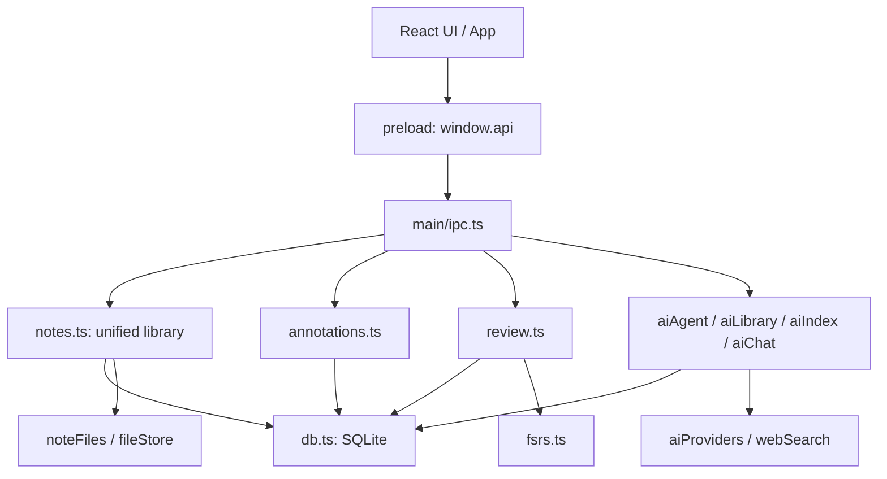

# Note-Tracker-XNote — Architecture / 架构

Start with the [README](../README.md) / [中文概览](../README.zh-CN.md). For setup and data backup, use the [usage guide](usage.md); for individual files, use the [source map](source-map.md).

**Reading order / 阅读主线:** UI → preload API → main services → storage. Library entries share stable IDs across editing, annotations, review and AI. / 界面经桥接层请求主进程，主进程读写数据；编辑、标注、复习和 AI 共用稳定的条目 ID。

This document describes the current source, not a promise that every external provider or file format has been tested. / 本文说明当前源码结构，不代表每种外部服务或文件格式均已实测。

## Runtime boundaries / 运行边界

- `src/main/index.ts` opens/migrates the database, organizes referenced image attachments, replays pending FSRS history, registers protocols/IPC and creates the window. / 主入口完成数据初始化、附件整理、待处理的复习回放及窗口创建。
- `src/preload/index.ts` exposes explicit API groups, stream subscriptions and TypeScript types. Renderer type imports do not execute main-process database code. / 预加载层暴露明确接口；界面引用主进程类型不等于直接运行数据库代码。
- `src/renderer/src/App.tsx` coordinates navigation, selected item, panels and AI current-document context; it also answers main-process extraction requests. / App 协调页面、选择、面板和当前文档，并响应正文提取请求。
- `DocumentView.tsx` chooses a viewer and owns annotation/mode/zoom state. `DocShell.tsx` supplies shared controls. `MdEditor.tsx` owns CodeMirror sessions and Markdown saving. / 文档控制器分配阅读器并管理共享状态，编辑器负责 Markdown 自身逻辑。

## Storage contract / 存储约定

`Note` actually represents `markdown`, `file` or `folder`. All three use the `notes` table and a UUID. `parent_id` and `sort_order` form virtual folders; moving a tree item does not move a corresponding physical folder. / Note 表示三类条目，UUID 串起所有模块，文件夹层级是数据库关系。

| Store / 存储 | Contents / 内容 |
| --- | --- |
| `notes/<id>.md` | Markdown body / Markdown 正文 |
| `files/<stored_name>` | Copied imported file or image bytes / 导入文件及图片字节 |
| `notes` | Item metadata, hierarchy, deletion and FSRS state / 元数据、层级、删除与复习状态 |
| `annotations` | Text, PDF, rectangle and drawing anchors / 文字、页面、区域及笔迹定位 |
| `review_logs`, `review_reflections` | Ratings, duration, intervals and reflections / 评分、用时、间隔与心得 |
| `param_groups` | Folder-inherited FSRS settings / 文件夹继承的复习参数 |
| `chunks`, `index_meta` | Extracted text, optional vector BLOBs, hash and index time / 提取文字、可选向量、指纹及索引时间 |
| `conversations`, `messages` | Chat models, content, sources and steps / 会话模型、文字、来源与步骤 |
| `meta` | Schema and migration/internal settings / 版本及迁移状态 |

SQLite schema version is 11; WAL and foreign keys are enabled. Migration backups cover the database, not all profile assets. Markdown writes use a temporary file and rename; imports retain original Markdown bytes, and editor changes are replayed onto original text to retain untouched BOM/line endings. / 当前结构版本为 11。正文使用临时文件替换；编辑器尽量保留未修改的原始文本格式。

## Main workflows / 核心流程

**Edit / 编辑:** FileTree → App selection → DocumentView → MarkdownRenderer → MdEditor → preload → IPC → notes → noteFiles + SQLite. Markdown syntax remains the document; `lib/md/livePreview.ts` decorates it, `widgets.ts` creates rendered blocks, and `commands.ts` changes source. / Markdown 源码是事实来源，预览仅改变展示。

**Annotate / 标注:** selection or Markdown source anchors → DocumentView toolbar → annotations API → SQLite → viewer decoration/overlay. `anchors.ts` handles source/display mapping and old-anchor migration. FreehandLayer stores normalized point lists and uses strokeGeom for erasing. / 标注独立保存，不把高亮或笔迹写进原 PDF/图片。

**Images / 图片:** MdEditor → files.addImage → notes.createImageAsset → dedicated attachment folder + fileStore → `xnote-file://<id>`. The main protocol serves bytes. Stable IDs keep references intact after move/rename. `livePreview`, `widgets` and `design.css` jointly control visual spacing. / 图片归档不依赖文件标题；图片间距涉及预览、部件高度和样式三处。

**Review / 复习:** ReviewSession → review queue → inherited group/exam context → fsrs → budgeted queue → DocumentView → rating/reflection → state/logs. `fsrs.ts` supplies memory and interval rules; `review.ts` supplies business/persistence. Again schedules one day; other intervals are whole days, with optional fuzz, a cap and future exam constraints. No same-day learning steps. / 算法与队列业务分开，主要调度单位为整个文件。

**Ask AI / AI 问答:** AiPanel → IPC → aiAgent → manifest/current text/history → aiProviders → optional list/search/read/web tools → streamed steps/text/sources → AiPanel → aiChat persistence. Main requests complex document extraction from App → aiExtract via a request/reply event. / AI 可以按需读取原文；聊天历史保存在本地。

**Index / 索引:** SettingsView → aiIndexRunner → aiExtract → aiIndex chunk/hash → optional real embedding → SQLite. Text chunks use 3,200 characters and 400-character overlap; local cosine scoring is not a separate vector database. Keywords work without a real embedding key. / 没有真实嵌入服务时可使用关键词路径。

## Source navigation / 源码导航

See [the complete source map](source-map.md) for all 82 source files, exported declarations and local imports. `ai.ts` is an older keyword interface retained by IPC; the current Find UI uses aiLibrary. `lib/markdown.ts` has no static caller in the current source and is retained as historical code. / 完整索引列出所有源码；旧实现保留，不因静态调用少而删除。

`styles.css` supplies structural/viewer internals; `design.css`, loaded later, supplies the visual system and most component styles. / 两个样式文件各有职责，后加载样式可能覆盖同等优先级规则。

No application server, cloud synchronization or automatic updater is implemented in the inspected source. Native dependencies and external providers are distinct from the local library. / 当前未实现独立应用服务器、云同步或自动更新。
